# TrueFit blog website

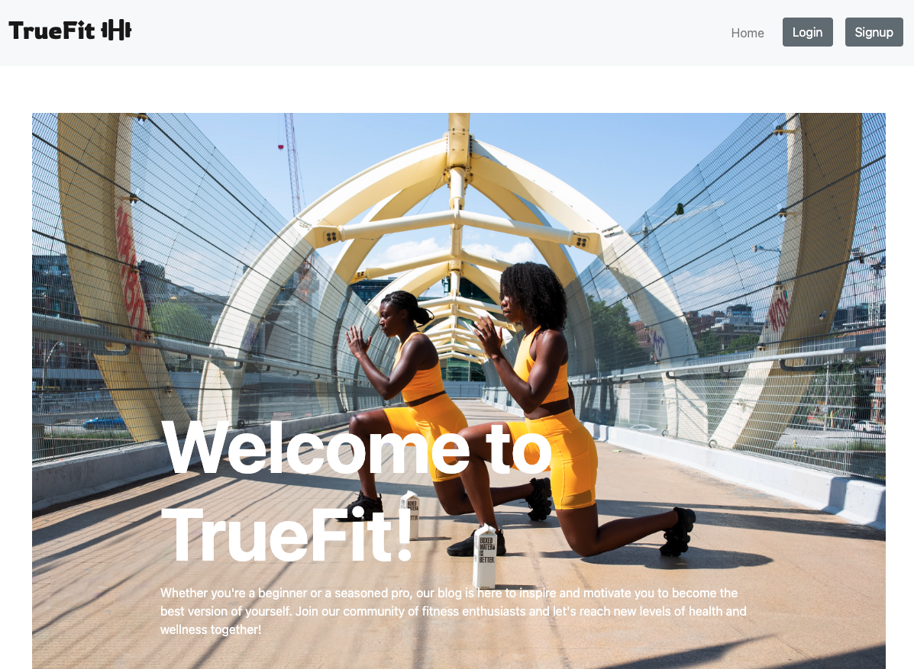

[Visit the live site](https://portfolio-4-fitnessblog.herokuapp.com/).

The purpose of this application is to help users find useful information on fitness, nutrition and other related subjects while also being able to post articles and interact with other blog members through the comment section.

* The Home page for first time users has an attractive image welcoming the user and with a brief explanation of what the blog is
* All users can create edit or delete their own articles, like and comment on other perople's articles if logged in.
* If the first time user doesn't want to sign-up he can still read the articles

***

## User Experience

### New User Stories

* As a new user, I want to be able to easily navigate the website and find relevant information on different types of exercises and workout plans.
* As a busy working professional, I want to be able to access short training articles that can be read in a short amount of time, such as 5 minutes or less.
* As someone recovering from an injury, I want to be able to find short articles that provide information and tips on how to safely exercise with specific limitations.

### Returning User Stories

* As a returning user, I want to be able to quickly access the features I’m interested in.
* As a returning user, I want to be able to leave comments on articles to share my own experiences and provide feedback to the author.
* As a returning user, I want to be able to like or upvote articles that I find helpful or informative, so that other users can easily see which articles are most valuable.

## Design

The site uses the Bootstrap framework. I used a simple colour pallete that makes the article content pop out.

#### Colours and Shades

* The site uses a light shade of grey for the site’s header and footer, and a darker shade for the LogIn/SignUp buttons.

* The color of the background is white and text is black to reinforce the contrast and make it easier to read for the user.

* Colours are used consistently in association with a particular type of task:

* Dark grey is used on the login / signup buttons.

* Bootstrap's light blue (Primary) is used on the Read article button / and for the articles with the category "Training".

* Bootstrap's green (Success) is used for the articles with the category "Nutrition" and edit button.

* Bootstrap's red (danger) is used for the delete button.

#### Typography

* The site logo uses the Rowdies font [Rowdies font](https://fonts.google.com/specimen/Rowdies) from Google Fonts. This font was selected for its high legibility and simple yet elegant design.

* All other text on the site uses the standard Bootstrap framework font stack, which consists of a number of simple, legible sans-serif fonts targeted at a range of different viewing devices and operating systems.

#### Imagery

* [Font Awesome 6](https://fontawesome.com/) icons are used for the logo and the comment and like buttons.

* [Unsplash ](https://unsplash.com/) I used a stock photo from unsplash the home page.(https://unsplash.com/photos/zQNDCje06VM)
* [Unsplash ](https://unsplash.com/) I used stock photos from unsplash for all 3 of the pre-written articles thumbnails.(https://unsplash.com/photos/)

## Wireframes

The site is responsively designed to adapt to the user's viewing device.

### Desktop view wireframe

 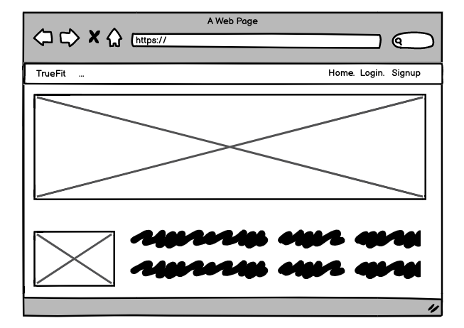

### Mobile view wireframe

 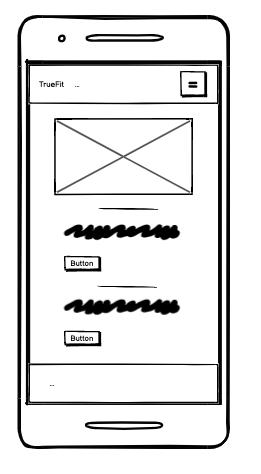

## Home Desktop view

 

 ## Mobile Home view

 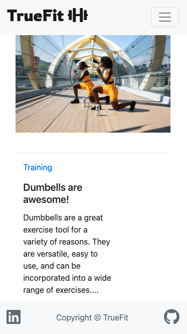
 
 ## Log in desktop view

 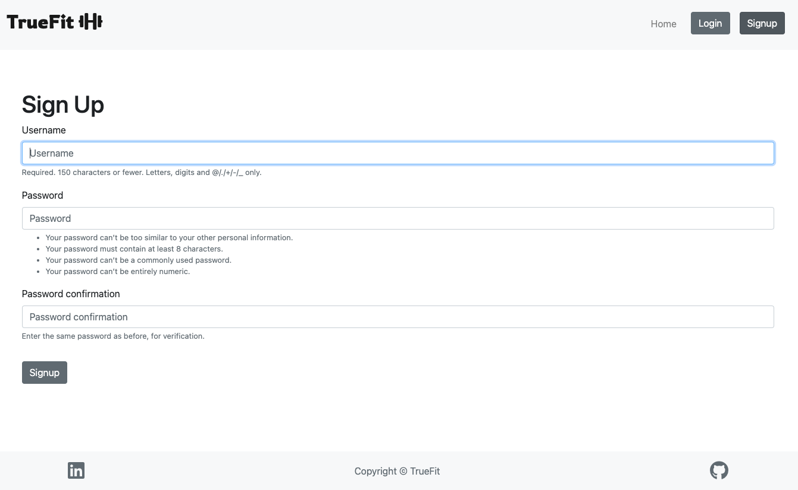  

  ## Log in mobile view

 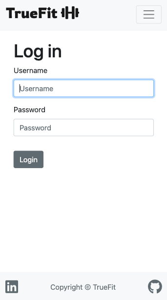  

 ## Sign up mobile view

 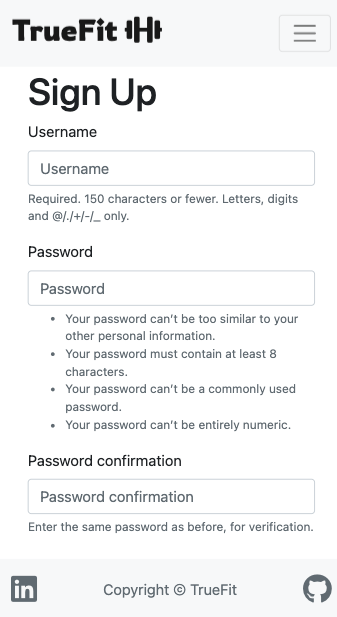  
***

## Features

### User Accounts

TrueFit blog features a user account system whereby users can create a persistent account, accessed by username and password, and store blog posts associated with their account, also likes and comments posted on other user's posts are unique to each account to prevent duplicated comments or one user giving unlimited likes to one post.

* Users create accounts by filling in a simple registration form.

* Users sign in to their accounts by filling in a login form and sign out using a link in the navigation bar.

* The application uses Django pre written authentication to handle user signup and login functionality.

### Create new articles

The core feature of TrueFit is the ability to create unique posts for each user, even using HTML if the user wanted to for more flexibility on how his article is displayed. Full CRUD (create, read, update, delete) functionality is implemented for blog posts. This means although a visiting user can only read the already posted articles, signed up users can add, delete and edit their own posts while also being able to comment and like other people's posts.

* New blog posts (articles) are added by completing a form, which is located on the main navbar but only for logged in users.

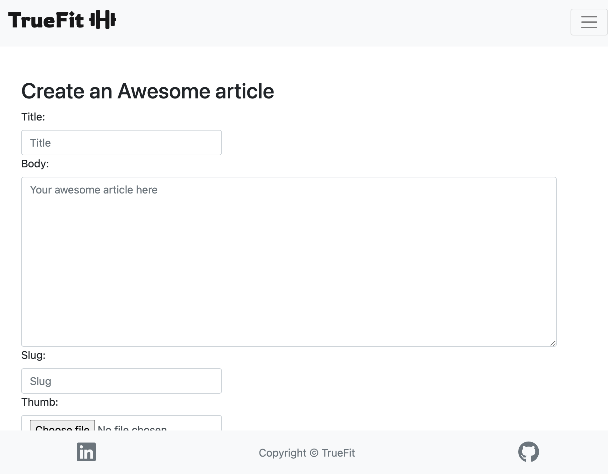

* All articles are listed on the home page and the category of each article is color coded.

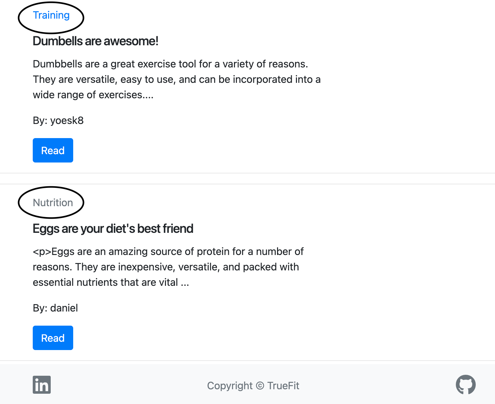

* When editing an article, the form is prepopulated with the current values of that article.

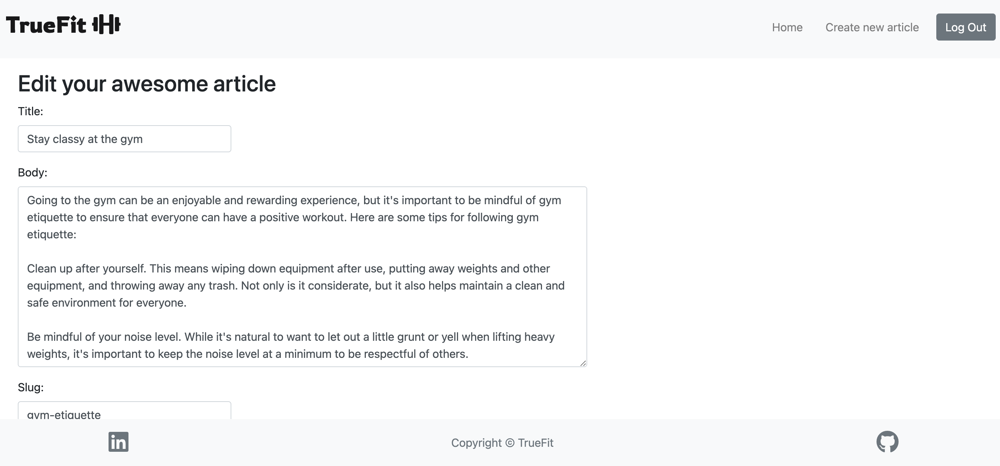

### Article management

* By design, users can only edit or delete their own  articles, as this prevents altering of other people's article posts. This allows the user to remain confident that their articles won't be tampered with.

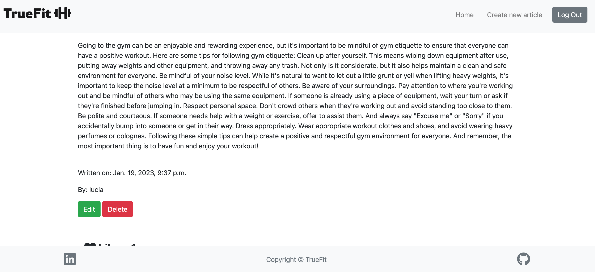

### Donation Page

* In order to be able to support the owner of the website without having to resort to paid ads, I've added a donation page that allows logged in users to say thanks with a donation with the help of [Stripe](https://stripe.com/)'s API 

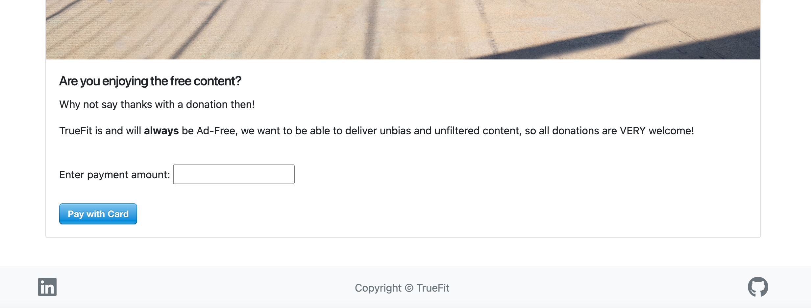

***

## Database Design

TrueFit uses a SQL database. Data is divided into three collections, with the following schema:

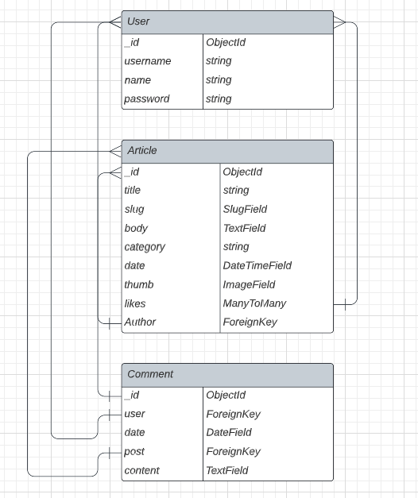

***

## Future Features

The following features could be added in the future, given more development time:

### 1. Account Management Tools

* Helpful account management tools could be provided, such as the ability to update usernames, email addresses and passwords.
* A password recovery by email function could also be provided. Django authentication tools could be used for this.

### 2. Article Filters

* The ability for all users to filter the articles by category.

### 3. Search Articles

* The ability to search articles that contain a word or words in either the title or body 

### 4. Chat functionality

* The ability to chat with other users of the blog. Django channels could be used for this.

### 5. Code optimization and refactoring

* This was my first major project using Python and Django, so there are a few areas where I feel the code could be made neater and more efficient.
* In particular, replacing some function based views with class based view

***

## Technologies

### Languages Used

* [HTML5](https://en.wikipedia.org/wiki/HTML5)
* [CSS3](https://en.wikipedia.org/wiki/CSS)
* [JavaScript](https://en.m.wikipedia.org/wiki/JavaScript)
* [Python](https://en.m.wikipedia.org/wiki/Python_(programming_language))

### Frameworks, Libraries & Programs Used

1. [GitHub](https://github.com/) - Used for version control.
2. [GitPod](https://gitpod.io/) - Used to write all code and test before deploying to GitHub.
3. [Balsamiq](https://balsamiq.com/) - Used to produce design wireframes.
4. [Bootstrap4](https://bootstrap.com/) - Bootstrap 4 CSS framework used extensively to create layout and styling of site.
5. [Python 3.8](https://www.python.org/) - Used to code the application.
6. [ElephantSQL](https://www.elephantsql.com/) - Used for the application's database.
7. [Django](https://www.djangoproject.com/) - Used to build the main application structure and page templates 
8. [Django storages](https://django-storages.readthedocs.io/en/latest/) - Used to connect web app with Amazon AWS S3 Bucket
9. [AWS](https://aws.com) Used to store static files
9. [Heroku](https://heroku.com/) - Used to deploy the site.
10. [W3C.org](https://www.w3.org/) - W3C [HTML Validator](https://validator.w3.org/nu/) and [CSS Validator](https://jigsaw.w3.org/css-validator/validator) used to check HTML and CSS code for errors.
11. [JSHint](https://jshint.com/) - Used to check JavaScript for errors.
12. [Pycodestyle](https://pypi.org/project/pycodestyle/) - Used to check Python code for errors.
13. [ChatGPT](https://chat.openai.com/chat) - Used to generate dummy articles and to explain and check code
14. [Stripe](https://stripe.com/) - Used to accept donations

***

## Testing

## Functionality testing 

 I used Chrome developer tools throughout the project for testing and solving problems with responsiveness and style issues.

## Compatibility testing
 Site was tested across multiple virtual mobile devices and browsers. I checked all supported devices in Chrome developer tools. 
 
 I tested on hardware devices such as: Ipad air with iOS, Iphone 13 mini with iOS 15.4, Macbook air with MacOS and Surface Pro with windows 10

## Unit Tests

I created unit tests for the login and signup page with django tests

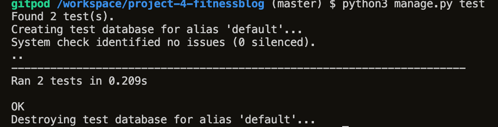

---
# Issues found during site development

* ## Edit Article view creating additional article instead of editing existing one

When editing existing articles, once the "Update" button was clicked, the edit article view would create an aditional article onto the database instead of updating the existing one

> This was due to the action attribute on the form pointing to the "articles:create" url, as I had copy the form from the article_create html template and had forgotten to delete this, all I had to do to fix this error was to delete the action as shown on the picture bellow.

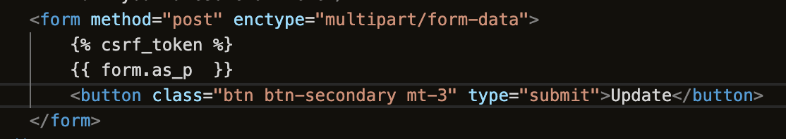

* ## Secret Key being exposed

When first creating my project I forgot to add the sqlite database to the .gitignore which cause django's secret key to be exposed when pushing to github

> Thankfully gitguardian let me know almost instantly that it had happened, so I generated a new secret key and made sure to add the sqlite database to the .gitignore before pushing to github.

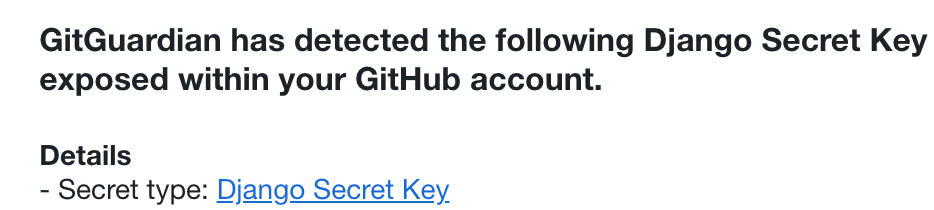

* ##  Images not loading from Amazon s3 bucket.

This one was a tough one to spot as I was sure that I had followed step by step the tutorial on storing static files on my amazon bucket. When I uploaded my files to my amazon bucket, the deployed site was not displaying any images despite the css styling being applied, telling me that the error was exclusively with the images and not all staticfiles.

> I have to give credit to the amazing CodeInstitute Slack comunity, which guided me in the right direction, it turns out that the url configuration is specific to the Region where the bucket is, and unlike the US region where the url just ends in ".s3.amazonaws.com" for the EU region the region has to also be added to the url, like the image shows below

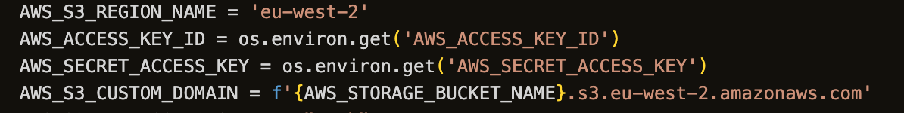

## Performance testing

I run [Lighthouse](https://developers.google.com/web/tools/lighthouse/) tool to check performance of the website.
Screenshots are presented below:

Final results:
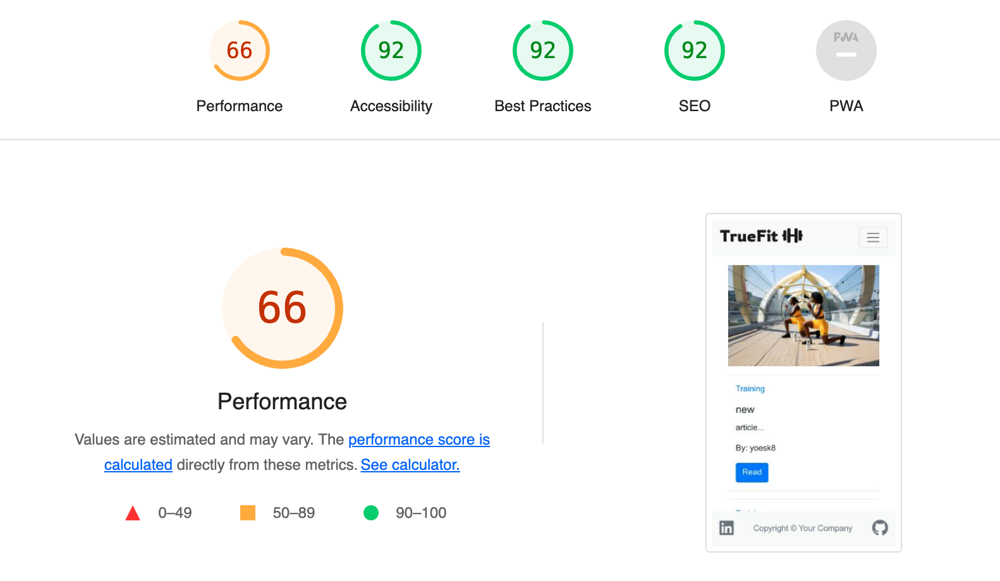

I noticed that this tests scores vary from time to time and depends on external libraries as well. 

## Code Validation
 At the end of the project I used three websites to validate my code:
 
 * [W3C CSS Validator](https://jigsaw.w3.org/css-validator/) to validate CSS

 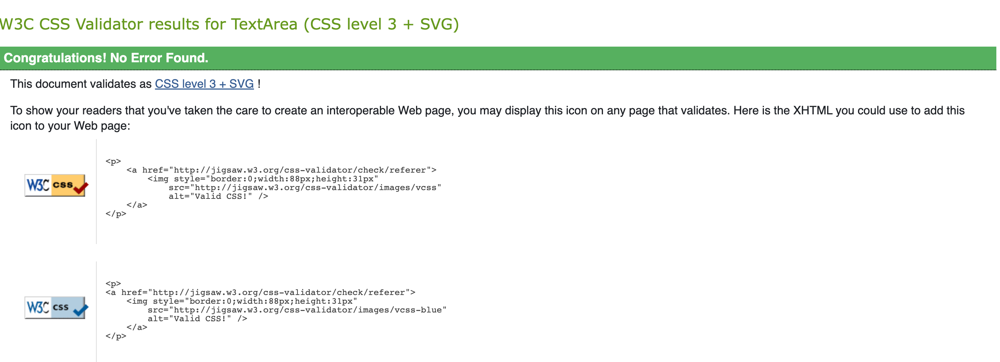

 * [Nu Html Checker](https://validator.w3.org/) to test HTML

 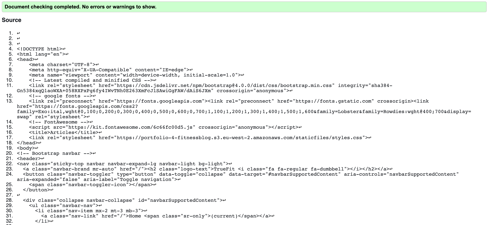

 
 * [Pycodestyle](https://pypi.org/project/pycodestyle/) to test python files

***

## DEPLOYMENT
**Step 1:** Create a new app in Heroku, choose a unique name and region.
**Step 2:** Login to ElephantSQL, access the dashboard and create a new instance (input a name, select a region).
**Step 3:** Return to dashboard, copy the database URL:
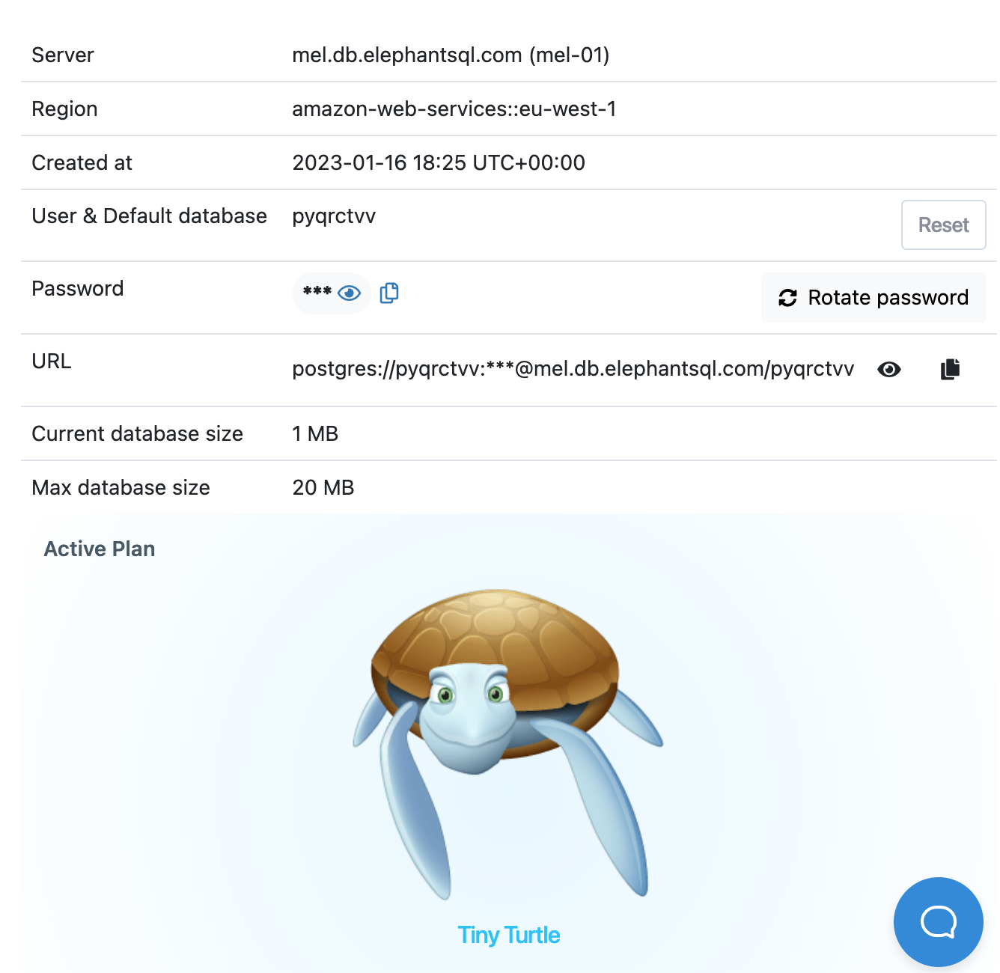

**Step 4:** Create env.py file (ensure it is included in .gitignore file) and add environment the below variables. Paste the URL from above:

**Step 5:** Include a secret key in the variables:

**Step 6:** Include the below code to settings.py file:

**Step 7:** Link the database in settings.py and migrate then push to GitHub:

**Step 8:** In Heroku, add three config vars:

**Step 9:** Login to Cloudinary, copy the API Environmental variable to dashboard and add to env.py (see screenshot above) & to Heroku config vars:

**Step 10:** Add cloudinary to installed apps in settings.py, add static/media file settings:

**Step 11:** Add template directories in settings.py, add Heroku host name to allowed hosts and add directory files:

**Step 12:** Create a Procfile, then commit and push to GitHub:

**Step 13:** Connect GitHub account in Heroku, connect and deploy branch. Open app and check:

## Other Credits and Acknowledgements

* [Code Institute](https://codeinstitute.net/) for their helpful lessons and reference materials.
* [Code Institute Sample README](https://github.com/Code-Institute-Solutions/SampleREADME/blob/master/README.md) for the structure of this project's documentation and parts of the GitHub forking and cloning processes.
